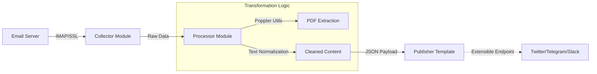

# Automated Content Aggregator (ETL Pipeline)


## 📡 Project Overview
This repository hosts a backend automation tool designed to solve the problem of "Information Overload." It functions as an **ETL (Extract, Transform, Load)** pipeline that autonomously monitors email inboxes for specific newsletters, extracts content (including PDF attachments), and normalizes the data for downstream distribution.

The project focuses on the **Ingestion and Processing** layers, providing a structured data stream ready for any social media or messaging API integration.

## 🏗 Architectural Workflow

The system is built on a modular architecture to ensure separation of concerns between data collection, processing, and output.



## 🧩 Core Modules

### 1. The Collector (`collector.py`)

* Connects to IMAP servers using secure SSL sockets.
* Filters incoming stream based on sender whitelists and subject keywords.
* Downloads attachments dynamically for local processing.

### 2. The Processor (`processor.py`)

* **Binary Handling:** Utilizes **Poppler** bindings to render and parse PDF documents attached to emails.
* **Normalization:** Converts unstructured document data into a structured format (JSON) suitable for the publishing layer.

### 3. The Publisher (`publish.py`)

* **Role:** Output Interface Layer.
* **Current State:** Contains the architectural skeleton for content distribution. It is designed as a template where developers can inject specific API logic (e.g., Twitter v2, Telegram Bot API) to consume the processed data.

## 🛠 Technical Stack

* **Language:** Python 3.x
* **Parsing:** `poppler-utils` (PDF Processing)
* **Configuration:** JSON-based environment management (`config.json`)

## 🚀 Setup & Usage (Local)

1. **Prerequisites:**
Ensure `poppler` is installed on your system (required for PDF parsing).
```bash
# Ubuntu/Debian
sudo apt-get install poppler-utils

```


2. **Configuration:**
Rename `config-example.json` to `config.json` and update mail server credentials.
3. **Execution:**
```bash
python collector.py

```


---

*Developed by **Muhammet Işık** as an automated information retrieval prototype.*
