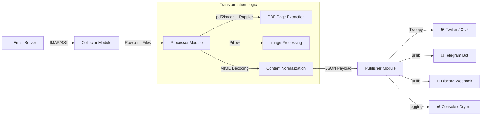

# Automated Content Aggregator (ETL Pipeline)


---

## 📋 Table of Contents

- [📌 Project Overview](#-project-overview)
- [🏗️ Architectural Workflow](#️-architectural-workflow)
- [⚡ Core Modules](#-core-modules)
- [🛠️ Technical Stack](#-technical-stack)
- [⚙️ Setup & Installation](#️-setup--installation)
- [🧪 Testing & Verification](#-testing--verification)
- [🚀 Usage](#-usage)
- [📖 Technical Implementation](#-technical-implementation)
- [⚖️ License](#️-license)

---

## 📌 Project Overview

This repository hosts a backend automation tool designed to solve the problem of **"Information Overload."** It functions as an **ETL (Extract, Transform, Load)** pipeline that autonomously monitors email inboxes for specific newsletters, extracts text/HTML content (including PDF/image attachments), and processes the data for distribution to social media or messaging platforms.

The project features a **multi-channel publishing layer** that can output to Twitter/X (v2), Telegram, Discord, or simply dry-run to the console.

---

## 🏗️ Architectural Workflow

The system is built on a modular architecture to ensure separation of concerns between data collection, processing, and output.


```mermaid
graph LR
    Source[📧 Email Server] -->|IMAP/SSL| Collector[Collector Module]
    Collector -->|Raw .eml Files| Processor[Processor Module]

    subgraph Transformation Logic
        Processor -->|pdf2image + Poppler| PDF[PDF Page Extraction]
        Processor -->|Pillow| IMG[Image Processing]
        Processor -->|MIME Decoding| Clean[Content Normalization]
    end

    Clean -->|JSON Payload| Publisher[Publisher Module]
    Publisher -->|Tweepy| Twitter[🐦 Twitter / X v2]
    Publisher -->|urllib| Telegram[📢 Telegram Bot]
    Publisher -->|urllib| Discord[💬 Discord Webhook]
    Publisher -->|logging| Console[💻 Console / Dry-run]
```

---

## ⚡ Core Modules

| Module | File | Description |
| :--- | :--- | :--- |
| **Collector** | `collector.py` | Connects to IMAP servers using secure SSL sockets. Filters out personal emails, marks processed messages, and saves raw `.eml` files. |
| **Processor** | `processor.py` | Extracts email text, HTML, and attachments. Converts PDF pages to JPEG images using **Poppler** and processes other attachments using **Pillow**. Handles MIME decoding safely. |
| **Publisher** | `publish.py` | Handles multi-target publication (Console, Telegram Bot, Discord Webhook, Twitter API v2). Implements standard library handlers for HTTP-based messaging to minimize dependencies. |
| **Test Pipeline**| `test_pipeline.py` | A credentials-free integration test runner that generates mock emails, runs extraction/processing/publishing, and asserts accuracy. |

---

## 🛠️ Technical Stack

| Component | Technology |
| :--- | :--- |
| **Language** | Python 3.x |
| **Email Protocol** | IMAP4 with SSL/TLS |
| **PDF Processing** | `pdf2image` + `poppler-utils` |
| **Image Processing** | `Pillow` (PIL) |
| **Integrations** | `Tweepy` (Twitter/X v2), Telegram Bot API, Discord Webhook API |
| **Network Requests** | Standard Python `urllib` (for zero-dependency Telegram/Discord integrations) |
| **Configuration** | JSON-based file-system state management |

---

## ⚙️ Setup & Installation

### Prerequisites

**1. Install Poppler** (required for converting PDF to image pages):

```bash
# Ubuntu/Debian
sudo apt-get install poppler-utils

# macOS (Homebrew)
brew install poppler

# Windows (Chocolatey)
choco install poppler
```

**2. Install Python Dependencies:**

```bash
pip install Pillow pdf2image tweepy
```

### Configuration

1. Rename `config-example.json` to `config.json`:

   ```bash
   cp config-example.json config.json
   ```

2. Update `config.json` with your credentials:
   ```json
   {
     "email": "your-email@example.com",
     "password": "your-email-password",
     "imap_server": "imap.example.com",
     "poppler_path": "",
     "publisher_target": "console",
     "telegram_bot_token": "your-telegram-bot-token",
     "telegram_chat_id": "your-telegram-chat-id",
     "discord_webhook_url": "your-discord-webhook-url",
     "twitter_api_key": "your-twitter-api-key",
     "twitter_api_secret": "your-twitter-api-secret",
     "twitter_access_token": "your-twitter-access-token",
     "twitter_access_token_secret": "your-twitter-access-token-secret"
   }
   ```

> **Note:** On Windows, set `poppler_path` to the full path of your Poppler `bin` directory (e.g., `C:\\Tools\\poppler\\bin`). Leave it empty if Poppler is in your system PATH.
> Set `"publisher_target"` to one of: `"console"`, `"telegram"`, `"discord"`, or `"twitter"`.

---

## 🧪 Testing & Verification

You can verify that the entire processor and publisher pipeline is fully operational **without configuring any email credentials or API keys** by running:

```bash
python test_pipeline.py
```

This script will:
1. Back up your existing `config.json`.
2. Generate a mock multipart email with base64-encoded text and image attachments.
3. Run `processor.py` to extract contents.
4. Run `publish.py` in `"console"` mode to print the publication draft.
5. Restore your original configuration.

---

## 🚀 Usage

### Step 1: Collect Emails
```bash
python collector.py
```
Connects to the IMAP server and downloads new newsletter emails to the `rawcontent/` directory.

### Step 2: Process Content
```bash
python processor.py
```
Extracts text, HTML, and attachments from collected raw emails, converts PDFs/images, and saves structured JSON metadata to the `content/` directory.

### Step 3: Publish Content
```bash
python publish.py
```
Publishes unpublished posts to your configured target (`publisher_target`).

---

## 📖 Technical Implementation

### Key Functions

| Function | Module | Description |
| :--- | :--- | :--- |
| `collect_unread_emails()` | `collector.py` | Searches IMAP for unread emails, registers UIDs, marks them read on the server, and saves raw content. |
| `is_personal_email()` | `collector.py` | Filters out personal emails from being processed. |
| `get_email_content()` | `processor.py` | Decodes MIME-encoded parts safely to extract plain text and HTML. |
| `ImageProcessor.process_pdf()`| `processor.py` | Converts PDF pages to JPEG images using Poppler. |
| `send_multipart_request()` | `publish.py` | Standard-library helper to send text and binary files via multipart/form-data. |
| `publish_telegram()` | `publish.py` | Dispatches text summaries and generated teaser images to Telegram. |
| `publish_discord()` | `publish.py` | Dispatches summaries and attachments to Discord. |
| `publish_twitter()` | `publish.py` | Dispatches tweets with media uploads via Twitter API v2. |

---

## ⚖️ License

This project is licensed under the MIT License - see the LICENSE file for details.

---

_Originally designed by **Muhammet Işık**, modernized to support multi-channel publishing._
