# Automated Content Aggregator (ETL Pipeline)


---

## 📋 Table of Contents

- [📌 Project Overview](#-project-overview)
- [🏗️ Architectural Workflow](#️-architectural-workflow)
- [⚡ Core Modules](#-core-modules)
- [🛠️ Technical Stack](#️-technical-stack)
- [⚙️ Setup & Installation](#️-setup--installation)
- [🚀 Usage](#-usage)
- [📖 Technical Implementation](#-technical-implementation)
- [⚖️ License](#️-license)

---

## 📌 Project Overview

This repository hosts a backend automation tool designed to solve the problem of **"Information Overload."** It functions as an **ETL (Extract, Transform, Load)** pipeline that autonomously monitors email inboxes for specific newsletters, extracts content (including PDF attachments), and normalizes the data for downstream distribution.

The project focuses on the **Ingestion and Processing** layers, providing a structured data stream ready for any social media or messaging API integration.

---

## 🏗️ Architectural Workflow

The system is built on a modular architecture to ensure separation of concerns between data collection, processing, and output.

```mermaid
graph LR
    Source[📧 Email Server] -->|IMAP/SSL| Collector[Collector Module]
    Collector -->|Raw .eml Files| Processor[Processor Module]

    subgraph Transformation Logic
        Processor -->|pdf2image + Poppler| PDF[PDF Page Extraction]
        Processor -->|Pillow| IMG[Image Processing]
        Processor -->|MIME Decoding| Clean[Content Normalization]
    end

    Clean -->|JSON Payload| Publisher[Publisher Module]
    Publisher -->|Tweepy| Twitter[🐦 Twitter]
```



---

## ⚡ Core Modules

| Module        | File           | Description                                                                                                                                                                               |
| ------------- | -------------- | ----------------------------------------------------------------------------------------------------------------------------------------------------------------------------------------- |
| **Collector** | `collector.py` | Connects to IMAP servers using secure SSL sockets. Filters personal emails and saves raw `.eml` files. Tracks collected UIDs in configuration.                                            |
| **Processor** | `processor.py` | Extracts email content including text, HTML, and attachments. Uses **Poppler** via `pdf2image` for PDF-to-image conversion. Processes images with **Pillow** and outputs structured JSON. |
| **Publisher** | `publish.py`   | Twitter API integration using **Tweepy**. Posts processed content to Twitter. Template for additional platform integrations.                                                              |

---

## 🛠️ Technical Stack

| Component               | Technology                        |
| ----------------------- | --------------------------------- |
| **Language**            | Python 3.x                        |
| **Email Protocol**      | IMAP4 with SSL/TLS                |
| **PDF Processing**      | `pdf2image` + `poppler-utils`     |
| **Image Processing**    | `Pillow` (PIL)                    |
| **Twitter Integration** | `Tweepy`                          |
| **Configuration**       | JSON-based environment management |
| **Data Format**         | JSON payload output               |

---

## ⚙️ Setup & Installation

### Prerequisites

**1. Install Poppler** (required for PDF parsing):

```bash
# Ubuntu/Debian
sudo apt-get install poppler-utils

# macOS (Homebrew)
brew install poppler

# Windows (Chocolatey)
choco install poppler
```

**2. Install Python Dependencies:**

```bash
pip install Pillow pdf2image tweepy
```

### Configuration

1. Rename `config-example.json` to `config.json`:

   ```bash
   cp config-example.json config.json
   ```

2. Update the configuration with your credentials:
   ```json
   {
     "email": "your-email@example.com",
     "password": "your-email-password",
     "imap_server": "imap.example.com",
     "poppler_path": "",
     "twitter_api_key": "your-twitter-api-key",
     "twitter_api_secret": "your-twitter-api-secret"
   }
   ```

> **Note:** On Windows, set `poppler_path` to the full path of your Poppler `bin` directory (e.g., `C:\\Tools\\poppler\\bin`). On Linux/macOS, leave it empty if Poppler is in your system PATH.

---

## 🚀 Usage

### Step 1: Collect Emails

```bash
python collector.py
```

This connects to your IMAP server and downloads unread newsletter emails to the `rawcontent/` directory.

### Step 2: Process Content

```bash
python processor.py
```

This extracts content from collected emails, converts PDF attachments to images, and saves structured JSON to the `content/` directory.

### Step 3: Publish Content

```bash
python publish.py
```

This posts processed content to Twitter using the configured API credentials.

---

## 📖 Technical Implementation

### Key Functions

| Function                       | Module                         | Description                                                 |
| ------------------------------ | ------------------------------ | ----------------------------------------------------------- |
| `load_config()`                | `collector.py`, `processor.py` | Loads configuration from `config.json`                      |
| `collect_unread_emails()`      | `collector.py`                 | Searches IMAP inbox for unread emails and saves raw content |
| `is_personal_email()`          | `collector.py`                 | Filters out personal emails based on recipient fields       |
| `decode_sender()`              | `processor.py`                 | Decodes MIME-encoded sender information                     |
| `get_email_content()`          | `processor.py`                 | Extracts text, HTML, and attachments from email             |
| `ImageProcessor.process_pdf()` | `processor.py`                 | Converts PDF pages to JPEG images using Poppler             |
| `sanitize_filename()`          | `processor.py`                 | Cleans filenames by removing invalid characters             |
| `authenticate_twitter()`       | `publish.py`                   | OAuth 1.0a authentication with Twitter API                  |
| `post_tweet()`                 | `publish.py`                   | Posts a message to Twitter                                  |

### Class Reference

| Class            | Module         | Description                                                                                         |
| ---------------- | -------------- | --------------------------------------------------------------------------------------------------- |
| `ImageProcessor` | `processor.py` | Handles image processing, deduplication via MD5 hashing, format conversion, and PDF page extraction |

### Dependencies

```python
# Standard Library
import imaplib      # IMAP protocol implementation
import email        # Email message parsing
import json         # Configuration and data serialization
import os           # File system operations
import hashlib      # MD5 hashing for image deduplication

# Third-Party
from PIL import Image           # Image processing (Pillow)
from pdf2image import convert_from_path  # PDF to image conversion
import tweepy                   # Twitter API integration
```

### Output Structure

Processed emails are saved as JSON with the following schema:

```json
{
  "sender": "Newsletter <news@example.com>",
  "recipient": "user@example.com",
  "date": "Mon, 01 Jan 2026 10:00:00 +0000",
  "subject": "Weekly Newsletter",
  "text_contents": ["Plain text content..."],
  "html_contents": ["<html>...</html>"],
  "attachments": ["document.pdf"],
  "processed_files": ["content/123_pdf_0.jpg", "content/123_pdf_1.jpg"]
}
```

---

## ⚖️ License

This project is licensed under the MIT License - see the LICENSE file for details.

---

_Designed by **Muhammet Işık** as an automated information retrieval prototype._
